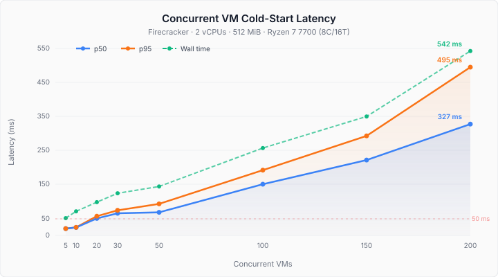

# Benchmark Results

## System Configuration

| Component | Details |
|---|---|
| CPU | AMD Ryzen 7 7700 8-Core (16 threads) |
| Clock | 545 - 5389 MHz |
| Cache | L1d 256 KiB, L1i 256 KiB, L2 8 MiB, L3 32 MiB |
| Memory | 61 GiB DDR |
| OS | Ubuntu 24.04.4 LTS (Noble Numbat) |
| Kernel | 6.8.0-107-generic |
| Firecracker | v1.15.0 |
| Arch | amd64 |

**VM Config:** 2 vCPUs, 512 MiB RAM (`configs/example.json`)

## Cold Start Baseline (2026-04-11)

**Iterations:** 50

| Metric | p50 | p95 |
|---|---|---|
| Cold start | 19.16 ms | 19.56 ms |
| Teardown | 16.70 ms | 27.02 ms |

## Concurrent VM Spawning (2026-04-11)

  

| Concurrency | Cold Start p50 | Cold Start p95 | Wall Time | Failed |
|---|---|---|---|---|
| 5 | 20.17 ms | 20.21 ms | 51 ms | 0 |
| 10 | 23.45 ms | 23.78 ms | 71 ms | 0 |
| 20 | 50.09 ms | 56.56 ms | 98 ms | 0 |
| 30 | 65.20 ms | 73.97 ms | 124 ms | 0 |
| 50 | 68.08 ms | 92.96 ms | 144 ms | 0 |
| 100 | 150.60 ms | 191.95 ms | 257 ms | 0 |
| 150 | 221.82 ms | 292.85 ms | 350 ms | 0 |
| 200 | 327.46 ms | 495.25 ms | 542 ms | 0 |

## Cold Start — Custom Devbox Image (2026-04-12)

**Image:** `devbox-rootfs.ext4` (4 GiB, Ubuntu 24.04 + Node.js 22, pnpm, TypeScript, Vite React-TS) built via [web-sandbox](github.com/ayush6624/web-sandbox)
**Iterations:** 50

| Metric | p50 | p95 |
|---|---|---|
| Cold start | 19.12 ms | 19.67 ms |
| Teardown | 18.08 ms | 28.35 ms |

The 4× larger custom rootfs (4 GiB vs 1 GiB baseline) has no measurable impact on cold-start latency — Firecracker maps the block device lazily, so image size doesn't affect boot time.

### Observations

- Single-VM cold start is remarkably consistent at ~19 ms (p50 vs p95 within 0.4 ms).
- Teardown p95 (27 ms) is notably higher than p50 (16.7 ms), suggesting occasional process cleanup delays.
- Concurrent cold start stays flat (~20 ms) up to c=10, then degrades roughly linearly with concurrency.
- At c=200, p95 reaches ~495 ms — still under 500 ms even with 200 × 2 = 400 vCPUs on 16 threads (25x oversubscription).
- Zero failures across all concurrency levels up to 200 VMs.
- Wall time scales sub-linearly: 200 VMs finish in 542 ms total, vs 200 × 19 ms = 3.8s if spawned sequentially.
- RAM is the true limit for steady-state packing: 200 × 512 MiB = 100 GB exceeds 64 GB physical RAM, so the kernel overcommits. For sustained workloads, ~120 VMs is the safe ceiling on this hardware.
